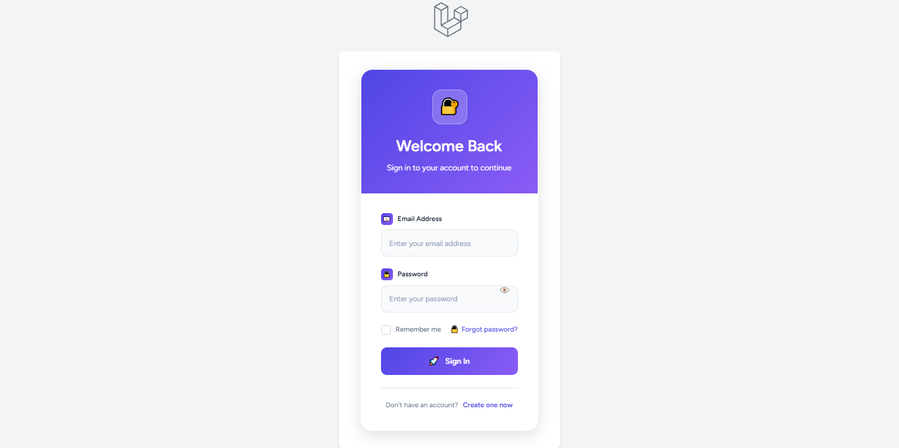
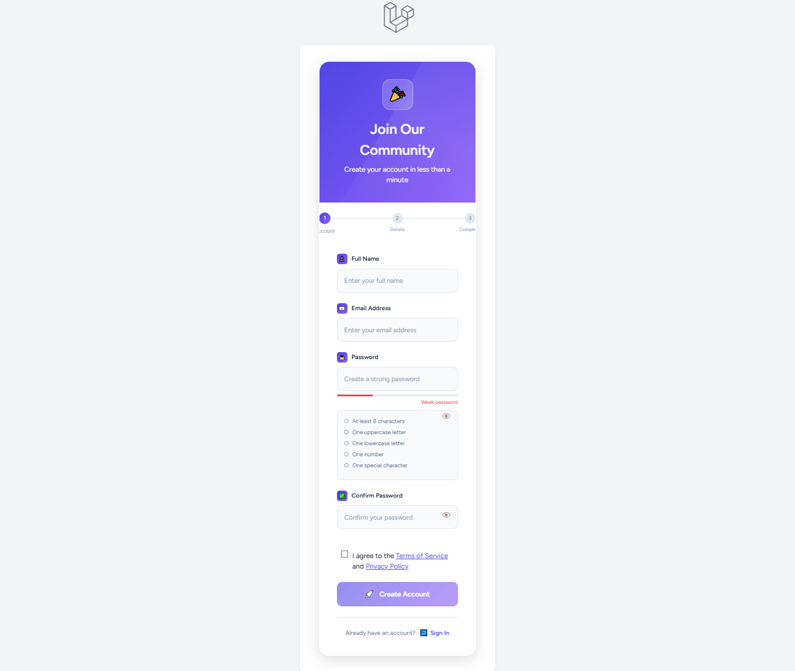
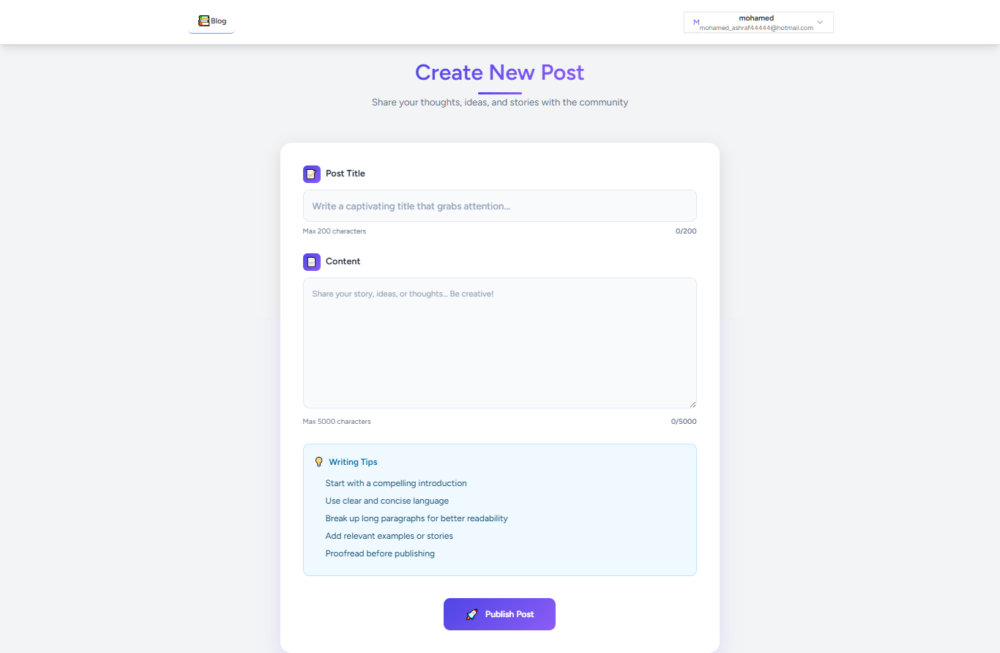
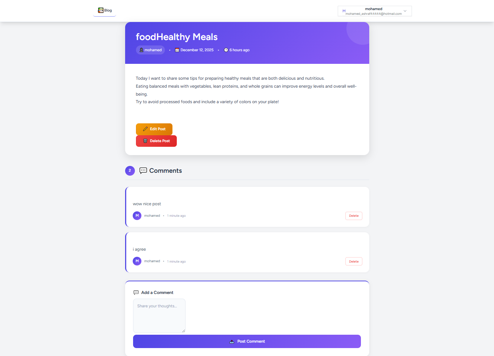
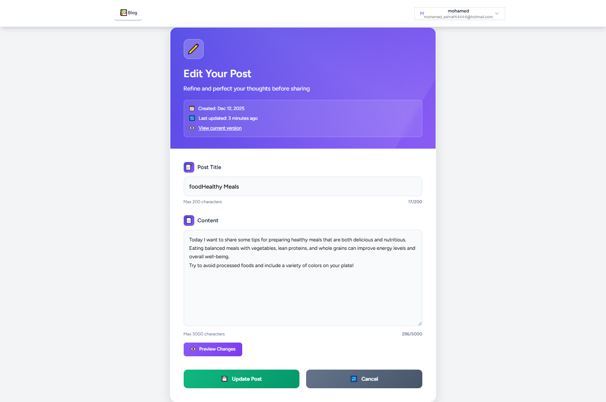

# Laravel Forum API  
A clean, SOLID-based Laravel project for posts, comments, notifications, API authentication, and advanced testing.

---

## 🚀 Features
- User Auth (Register / Login) using **Laravel Sanctum**
- Create / Edit / Delete Posts
- Comment on posts
- Send notification to post owner when a new comment is added
- API Resources for clean and structured responses
- Service Layer applying **SOLID Principles**
- Pest Feature & Unit Tests
- Mail Notifications (Mailgun / SMTP)
- Clean Project Architecture

---

## 📸 Screenshots
   **Login Page**  
        

   **Register Page**  
          

   **Main Page**  
        
        
   **Create Post**  
        

   **Post Actions And Comments**
        

   **Edit Post**  
        

    

## 📦 Installation

        git clone <repo-url>
        cd forum-api
        composer install
        cp .env.example .env
        php artisan key:generate

## ⚙️ Environment Setup
    Sanctum
        SESSION_DRIVER=cookie
        SANCTUM_STATEFUL_DOMAINS=localhost:8000

    Mailgun
        MAIL_MAILER=smtp
        MAIL_HOST=smtp.mailgun.org
        MAIL_PORT=587
        MAIL_USERNAME=xxx
        MAIL_PASSWORD=xxx
        MAIL_ENCRYPTION=tls
        MAIL_FROM_ADDRESS=no-reply@example.com
        MAIL_FROM_NAME="Forum API"

## 🗄️ Run Migrations

    php artisan migrate

## 🔑 Authentication (API)

    | Endpoint       | Method | Description         |
    |----------------|--------|---------------------|
    | `/api/register` | POST   | Register new user   |
    | `/api/login`    | POST   | Login and get token |
    | `/api/logout`   | POST   | Logout user         |

## 📝 Posts API

    | Endpoint          | Method | Description        |
    |-------------------|--------|--------------------|
    | `/api/posts`       | GET    | List all posts     |
    | `/api/posts`       | POST   | Create new post    |
    | `/api/posts/{id}`  | GET    | Show single post   |
    | `/api/posts/{id}`  | PUT    | Update post        |
    | `/api/posts/{id}`  | DELETE | Delete post        |

## 💬 Comments API

    | Endpoint                     | Method | Description           |
    |------------------------------|--------|-----------------------|
    | `/api/posts/{id}/comments`   | POST   | Add comment to post   |
    | `/api/comments/{id}`         | DELETE | Delete comment        |

## 📩 Notifications

### When a user comments on a post:
    - The **post owner** receives an **email notification**.
    - Notification class used: **`NewCommentNotification.php`**
    - Mail notification is fully integrated with Laravel's notification system.
    - Supports **queueing** (optional) for better performance.

## 🧱 Architecture

        app/
        ├── Http/
        │    ├── Controllers/
        │    ├── Resources/
        │    └── Requests/
        │
        ├── Services/
        │    ├── PostService.php
        │    └── CommentService.php   // Applying SOLID
        │
        ├── Notifications/
        │    └── NewCommentNotification.php
        │
        └── Models/

## 🧑‍💻 Author
 **Mohamed Ashraf**  
    📧 Email: mohamed_ashraf4444@hotmail.com  
    🌐 GitHub: [https://github.com/salah3122001](https://github.com/salah3122001)  
    🔗 LinkedIn: [https://www.linkedin.com/in/mohamed-ashraf-14916a367](https://www.linkedin.com/in/mohamed-ashraf-14916a367)

